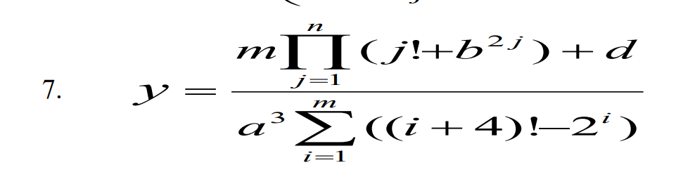
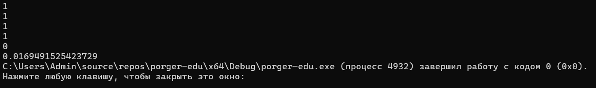
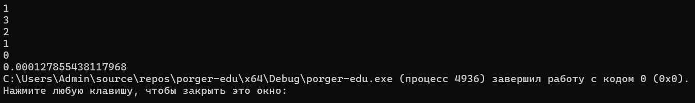
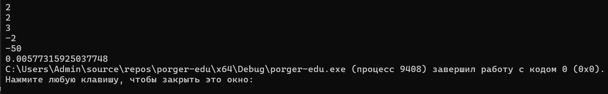

## 📋 Условие задачи

## Код решения

[main.cpp](main.cpp).

### Тест 1

**Ввод:** `1 1 1 1 0`

**Ожидаемый результат:** `0.0169491525423729`

### Тест 2

**Ввод:** `1 3 2 1 0`

**Ожидаемый результат:** `0.0001278551`

### Тест 3

**Ввод:** `2 2 3 -2 -50`

**Ожидаемый результат:** `0.0057731593`

